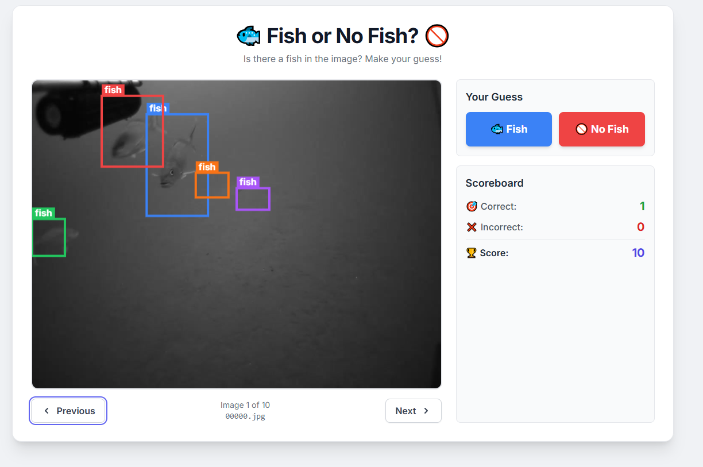

# Fish / No Fish Demo Using Gemini
This is a simple web-based game, deployable on GitHub Pages, where you guess if an image contains a fish. Spatial data batch processes from Gemini and loaded via json. 

